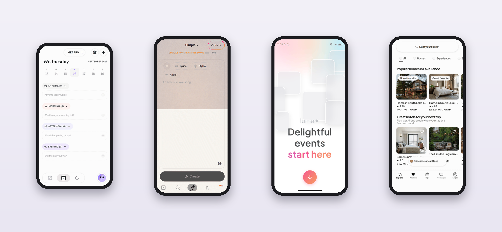
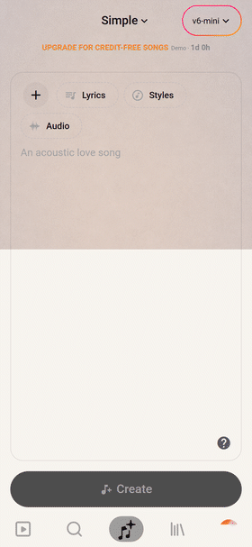
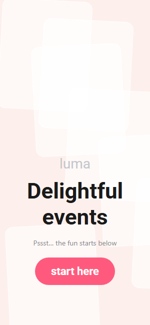
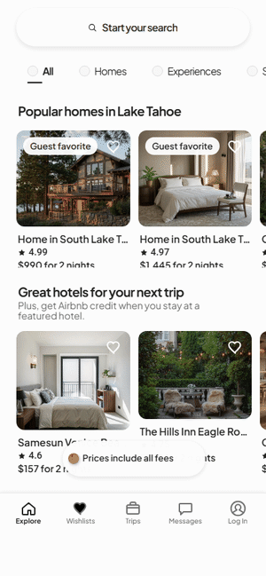

  

<h1 align="center">Awesome App DESIGN.md</h1>

  <strong>Real mobile app interfaces you can open and use — each with its source code and a DESIGN.md your AI agent can build from.</strong>

Most DESIGN.md collections describe a design. This one lets you **touch it**. Every entry is a high-fidelity, interactive recreation of a well-known mobile app — running in your browser, built with Expo, React Native and TypeScript — shipped together with the design system behind it.

| What you get | Typical DESIGN.md list | This list |
|---|:---:|:---:|
| A DESIGN.md your agent can read | ✓ | ✓ |
| A live demo you can tap through | — | ✓ |
| Source code for the recreated screens and flows | — | ✓ |
| Design notes on *why* the interface works | — | ✓ |

## Collection

### Productivity & Wellbeing

<table>
<tr>
<td width="300" align="center" valign="top">
  
</td>
<td valign="top">

#### [Tiimo](design-md/tiimo)

Visual day planner for people who find time hard to feel. Soft off-white calm, time-of-day tints instead of clock times, serif moments, and a lavender arc that shows focus time passing.

**Flows:** Today plan · task actions · Update-task sheet · focus timer · delete confirmation

[▶ Live demo](https://tiimo-ui.edgeone.cool) · [Source](https://github.com/migrant620/tiimo-ui) · [DESIGN.md](design-md/tiimo/DESIGN.md) · [Design notes](https://github.com/migrant620/tiimo-ui#design-notes)

</td>
</tr>
</table>

### Music & Audio

<table>
<tr>
<td width="300" align="center" valign="top">
  
</td>
<td valign="top">

#### [Suno](design-md/suno)

AI music creation. Warm paper canvas over a drifting aura, dashed add-on pills around a single prompt, a pink-to-orange gradient saved for the moment of making, and a player painted from the cover art.

**Flows:** Create (Simple and Advanced) · Search · full player with playback · Library and playlists · Hooks · Profile

[▶ Live demo](https://suno-ui.edgeone.cool) · [Source](https://github.com/migrant620/suno-ui) · [DESIGN.md](design-md/suno/DESIGN.md) · [Design notes](https://github.com/migrant620/suno-ui#design-notes)

</td>
</tr>
</table>

### Events & Social

<table>
<tr>
<td width="300" align="center" valign="top">
  
</td>
<td valign="top">

#### [Luma](design-md/luma)

Event discovery and hosting. A pale promo wall that drops into a login sheet, a dated event feed, a discover rail with category chips, a dark hero detail page painted from the cover, and a floating Create Event capsule.

**Flows:** Promo and login · Home feed · Discover · Event detail (hero, host, location, about) · Create form and cover gallery · Empty states

[▶ Live demo](https://luma-ui.edgeone.cool) · [Source](https://github.com/migrant620/luma-ui) · [DESIGN.md](design-md/luma/DESIGN.md)

</td>
</tr>
</table>

### Travel & Stays

<table>
<tr>
<td width="300" align="center" valign="top">
  
</td>
<td valign="top">

#### [Airbnb](design-md/airbnb)

Photo-led white cards on a plain page, a near-black ink with a single rose accent, and a search sheet that reads as one sentence in three clauses (Where, When, Who).

**Flows:** Explore (All · Homes · Experiences · Services) · search sheet · results · listing detail · photo viewer · sign-in sheet

[▶ Live demo](https://airbnb-ui.edgeone.cool) · [Source](https://github.com/migrant620/airbnb-ui) · [DESIGN.md](design-md/airbnb/DESIGN.md) · [Design notes](https://github.com/migrant620/airbnb-ui#design-notes)

</td>
</tr>
</table>

More apps are added regularly. [Request one](#request-an-app) or ⭐ star the repo to follow along.

## What's inside each entry

| Piece | Where | What it's for |
|---|---|---|
| **Live demo** | `<app>-ui.edgeone.cool` | Tap through the recreated screens on your phone or desktop — no install, no account |
| **Source code** | `migrant620/<app>-ui` | Expo + React Native + TypeScript, runs on the web; real components, text and state rather than screenshots |
| **DESIGN.md** | `design-md/<app>/DESIGN.md` | Colours, type scale, spacing, radii, elevation, components and responsive rules in the [DESIGN.md format](https://stitch.withgoogle.com/docs/design-md/overview/) |
| **Design notes** | the app's README | What makes the interface work — the decisions worth borrowing |

## How to use

1. **See it in motion.** Open the live demo and try the flows listed on the card.
2. **Build with the design language.** Copy an app's `DESIGN.md` into your project root and ask your AI coding agent to build your screen in that style.
3. **Read the implementation.** Clone the source repo to see how a screen's tokens and components fit together, and run it locally with `npm ci --ignore-scripts && npm run web`.

## Request an app

Want to see a particular app here? [Open a request](https://github.com/migrant620/awesome-app-design-md/issues/new?title=App%20request%3A%20&body=App%3A%0AFlows%20you%20care%20about%3A%0AWhy%3A) with the app and the flows you care about. Popular requests are prioritised.

## Commission a prototype

Need an app's screens as a working prototype — for a pitch, a client demo or to align your team before development? I recreate chosen app interfaces and flows as high-fidelity, interactive prototypes and hand over the source code, including private work delivered only to you. [Start an enquiry](https://github.com/migrant620/awesome-app-design-md/issues/new?title=Prototype%20enquiry&body=App%3A%0AFlow%28s%29%3A%0APlatform%20%28web%2C%20Android%2C%20iOS%29%3A%0ATimeline%3A).

## Contributing

Corrections are welcome: if a colour, size or description looks off, [open an issue](https://github.com/migrant620/awesome-app-design-md/issues) describing what you see. To keep every entry at the same standard, new entries are produced by the maintainer rather than accepted as pull requests. See [CONTRIBUTING.md](CONTRIBUTING.md).

## License

The DESIGN.md files, notes and images in this repository are M620's own work, available for **noncommercial study and research** under the [M620 Study and Research License](LICENSE); each app's source repository carries its own copy of the license and its third-party notices.

Every entry is an independent recreation for study. App names and visual identities belong to their owners; this collection is not affiliated with or endorsed by them.
